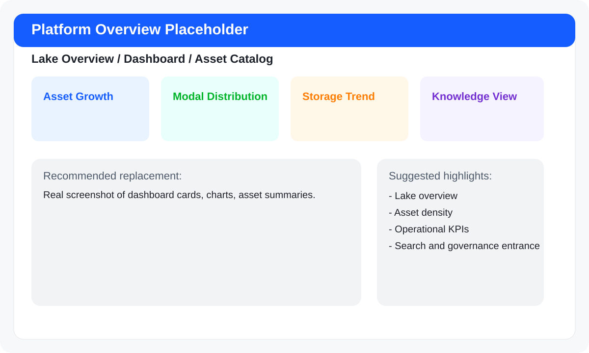
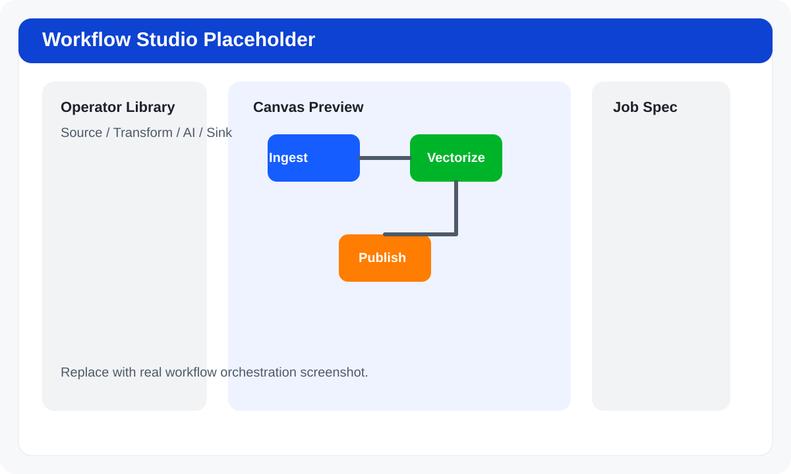
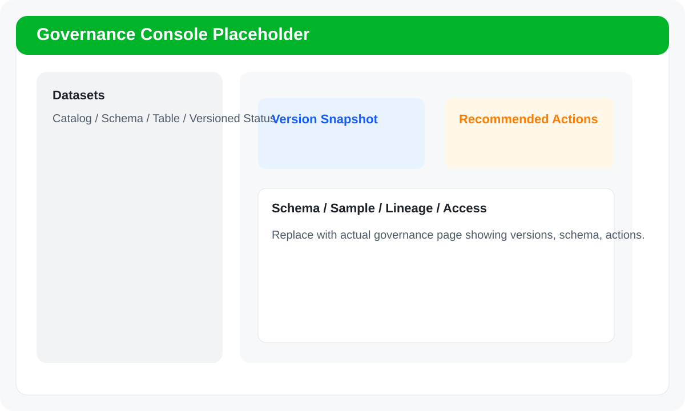
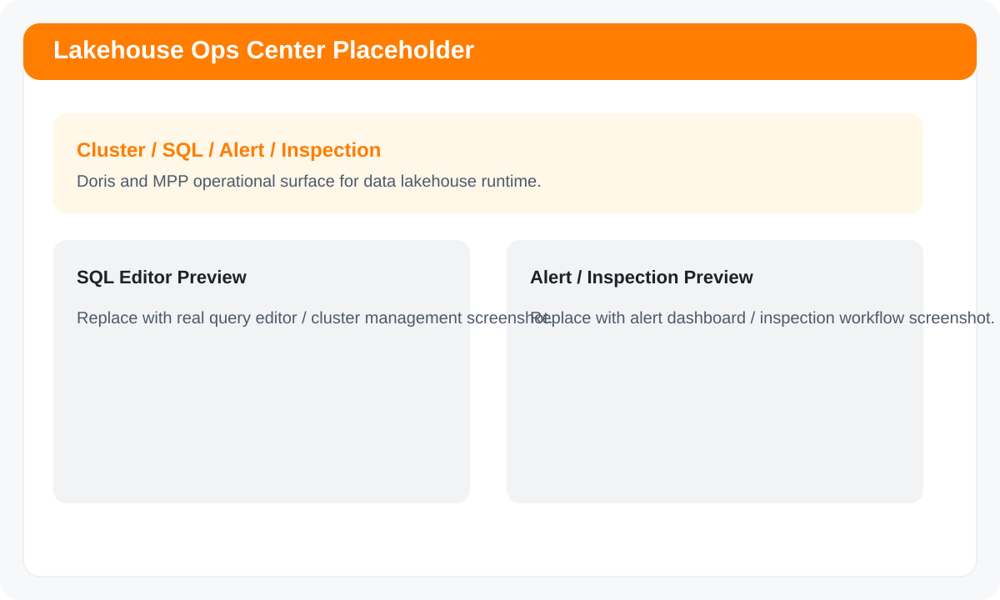

<div align="center">

# Multimodal Data Lake

**面向企业多模态资产的一体化数据湖仓运营平台**

*One platform for ingestion, retrieval, governance, workflow orchestration, and lakehouse operations across text, image, audio, and video.*

[](https://python.org/)
[](https://fastapi.tiangolo.com/)
[](https://react.dev/)
[](https://vitejs.dev/)
[](https://lancedb.com/)
[](LICENSE)

</div>

---

## What This Project Is

`Multimodal Data Lake` 不是单一的“向量检索 Demo”，也不是只会上传文件的样例后台。它试图把企业多模态数据资产从 **接入、入湖、索引、检索、治理、编排、运维、权限** 一路串起来，做成一个可操作、可展示、可继续工程化扩展的统一控制面。

它覆盖的不是单一角色，而是一整条链路：

- 数据工程师：关心接入、批量处理、索引和任务执行
- 算法 / AI 工程师：关心向量化、检索、标注、知识抽取和 Agent 协作
- 平台工程师：关心算子编排、作业模板、Ray / Doris / MPP 集成
- 管理员：关心用户、权限、日志、系统状态和运行边界

一句话概括：**这是一个把“多模态数据湖 + AI 检索 + 工作流编排 + 湖仓运维”放进同一个产品壳里的平台型仓库。**

---

## Capability Panorama

| 领域 | 能力 | 现有实现 |
|---|---|---|
| 数据接入 | 本地上传、来源接入、扫描、批量任务、索引构建 | `upload` / `workbench` / `ingestion` 页面与 API |
| 多模态入湖 | 文本、图片、音频、视频、压缩包等资源入湖处理 | `etl.py`、`models_loader.py`、`multimodal_store.py` |
| 统一检索 | SQL 查询、统一检索、向量检索、多模态检索、AI 副驾驶入口 | `search` API、`LakeQueryPage.jsx` |
| 工作流编排 | 工作流画布、算子中心、模板库、任务中心、作业实例 | `WorkflowStudio.jsx`、`operators` / `ray_compute` |
| 数据治理 | 资产目录、治理视图、版本统计、版本回滚、compaction 建议 | `files` / `versions` / `DataGovernancePage.jsx` |
| 湖仓运维 | MPP 代理、Doris 外表、SQL 编辑器、告警监控、自动巡检 | `mpp_proxy` / `doris` / `frontend/src/pages/mpp/*` |
| 系统与权限 | 用户管理、RBAC、系统状态、日志查看、来源配置 | `users` / `permissions` / `system` / `platform` |
| AI 能力 | 向量模型、Whisper、知识图谱抽取、Agent Team | `models_loader.py`、`knowledge_graph_extractor.py`、`agents/` |
| 多模态业务专题 | 自动化标注、检测追踪、复核清单、专题数据集 | `multimodal.py`、`multimodal_labeling.py`、`multimodal_trace.py` |

---

## Why It Feels Bigger Than a Typical Demo

- **不是单页展示**：前端已经具备湖总览、湖查询、湖计算、湖存储、湖治理、湖运维、系统配置、管理入口等完整导航层级。
- **不是孤立 API**：后端已经按业务域拆成 `upload / search / files / dashboard / workbench / platform / operators / versions / users / permissions / doris / ray / mpp / agents / multimodal` 多个模块。
- **不是只讲检索**：除了向量检索，还有工作流编排、作业模板、Ray 计算、Doris 外表、版本治理、权限与日志。
- **不是纯模型实验**：既有模型加载和推理，也有平台化的控制面、任务流和治理界面。

如果你要一句更“能打”的描述，可以这样说：

> **这是一个把企业多模态数据资产管理、AI 检索增强、工作流编排、湖仓治理和运维控制台融成一套界面的平台原型。**

---

## Functional Surfaces

### 1. 湖总览

- Dashboard 总览
- 资产目录 / 文件资产
- 模态分布、趋势、统计、知识图谱入口

### 2. 湖查询

- SQL 查询
- 统一检索
- 向量 / 多模态 / 混合检索扩展入口
- AI 数据副驾驶
- 自动化标注

### 3. 湖计算

- 工作流编排画布
- 算子中心
- 任务中心
- 作业实例
- 模板库

### 4. 湖存储

- 接入总览
- 来源接入
- 本地上传
- 批量扫描与建索引

### 5. 湖治理

- 数据治理视图
- 版本统计
- 版本回滚
- 表 compaction 管理建议

### 6. 湖运维

- MPP 集群管理
- SQL 编辑器
- 告警监控
- 自动巡检
- Doris 外部表与代理能力

### 7. 系统配置与管理入口

- 来源配置
- 系统日志
- 用户管理
- 权限管理

### 8. AI Agent Team

- BrainAgent：任务分析与拆解
- CodeAgent：实现与代码产出
- TestAgent：测试校验
- AgentCoordinator：协同编排

---

## Typical Scenarios

### 场景 1：企业资料统一入湖与统一检索

适合“资料散、格式杂、历史包袱重”的组织场景：

- 把 PDF、Word、PPT、表格、图片、音视频等资源统一接入
- 自动完成抽取、切片、向量化和索引
- 通过统一检索入口把“关键词搜索”和“语义搜索”合在一起
- 给分析、问答、副驾驶、治理视图提供统一资产底座

### 场景 2：多模态资产治理与版本追踪

适合“资产很多，但缺少版本治理和口径一致性”的平台团队：

- 统一查看 catalog / schema / table 下的资产
- 对 Lance 数据集做版本统计、历史版本查看、回滚和 compaction
- 结合结构、样本、责任归属、访问摘要做治理动作建议
- 用治理台账替代“靠人记忆”的资产状态管理

### 场景 3：工作流编排与任务化执行

适合“流程长、人工拼接多、算子复用低”的工程团队：

- 在工作流画布中组织 Source / Transform / AI / Sink 算子
- 生成任务定义、资源规格和执行顺序
- 用模板库、作业实例、任务中心把一次性流程沉淀为可复用资产
- 为后续 Ray 计算、批处理、数据生产链路做统一编排入口

### 场景 4：湖仓一体的查询与运维控制台

适合“数据在湖里、查询在仓里、运维在多个系统里”的平台场景：

- 通过 Doris 外表、MPP 代理、SQL 编辑器把分析入口统一起来
- 用告警监控、自动巡检和系统日志把运行态纳入控制面
- 让平台运维和数据治理不再是两套割裂界面

### 场景 5：多模态专题数据集与自动化标注

适合“检测、复核、追踪、标注”类多媒体业务场景：

- 管理专题数据集、自动化标注任务和复核清单
- 保存检测追踪和查询轨迹
- 把多模态业务专题从原始素材管理升级到任务化、治理化、可追踪的资产体系

---

## Data and AI Pipeline

项目中的主线能力可以理解为下面这条链路：

1. **接入数据**：本地上传、目录扫描、远程来源接入
2. **解析与抽取**：按文档 / 图片 / 音视频类型做内容处理
3. **向量化入湖**：文本、图像、音频进入统一检索体系
4. **资产管理**：文件、版本、统计、标签、追踪信息落库
5. **查询与治理**：统一检索、资产视图、版本治理、表运维
6. **编排与执行**：工作流画布、算子模板、任务执行、Ray 计算
7. **平台运营**：Doris / MPP / 权限 / 日志 / 告警 / 巡检

---

## Architecture

```text
┌─────────────────────────────────────────────────────────────┐
│                         React Frontend                      │
│  Dashboard / Search / Workflow / Governance / Ops / Admin  │
└──────────────────────────────┬──────────────────────────────┘
                               │
                               ▼
┌─────────────────────────────────────────────────────────────┐
│                        FastAPI Backend                      │
│                                                             │
│  upload      search       files        dashboard            │
│  workbench   platform     operators    versions             │
│  users       permissions  system       agents               │
│  ray         doris        mpp_proxy    multimodal           │
└───────────────┬───────────────────────┬─────────────────────┘
                │                       │
                ▼                       ▼
┌────────────────────────────┐   ┌────────────────────────────┐
│        Storage Layer       │   │        AI / Compute        │
│  SeaweedFS / S3 Object     │   │  BGE / CLIP / Whisper      │
│  LanceDB Vector Lake       │   │  DeepSeek Integration      │
│  SQLite Metadata           │   │  Ray / Doris / MPP         │
└────────────────────────────┘   └────────────────────────────┘
```

当前默认运行约定已经收敛为：

- `start.py` 负责编译前端并启动后端
- 前端静态资源由后端统一托管
- 默认单入口是 `http://127.0.0.1:27843/workflow`
- 如需纯前端开发模式，再单独启动 Vite

---

## Interface Preview

下面这组资源是 README 级的界面占位图，已经可以直接挂到仓库文档里。后续替换成真实截图时，只需要覆盖 `docs/readme-assets/` 下同名文件。

### 平台总览



### 工作流编排



### 数据治理控制台



### 湖仓运维中心



---

## Tech Stack

### Frontend

- React 18
- Vite 5
- React Router
- Arco Design
- ECharts
- Axios

### Backend

- FastAPI
- Uvicorn
- Pydantic v2
- JWT + Passlib

### Storage and Query

- LanceDB
- SQLite
- SeaweedFS / S3-compatible object storage
- DuckDB
- Doris / MPP proxy integration

### AI and Processing

- Sentence Transformers
- CLIP
- Whisper
- DeepSeek integration
- pandas / pypdf / python-docx / python-pptx / openpyxl / Pillow / pdf2image

---

## Supported Data Types

当前仓库已经围绕以下资源类型组织处理能力：

- 文本：`txt`、`md`、`log`
- 文档：`pdf`、`docx`、`pptx`
- 表格：`csv`、`xlsx`、`xls`
- 代码与结构化文本：`py`、`js`、`json`、`sql`、`sh`
- 图像：`jpg`、`jpeg`、`png`、`gif`、`bmp`、`webp`
- 音频 / 视频：`mp3`、`wav`、`m4a`、`mp4`、`avi`、`mov`
- 压缩包：`zip`、`tar`、`gz`、`tgz`

---

## Quick Start

### 1. Clone

```bash
git clone https://github.com/854875058/multimodal-data-lake.git
cd multimodal-data-lake
```

### 2. Create Python Environment

```bash
conda create -n multimodal-lake python=3.11 -y
conda activate multimodal-lake
pip install "numpy<2.0"
pip install -r requirements.txt
```

### 3. Build Frontend

```bash
cd frontend
npm install
npm run build
cd ..
```

### 4. Configure Runtime

按需调整 `config.py` 或环境变量：

- S3 / SeaweedFS 连接信息
- LanceDB 存储位置
- DeepSeek API Key
- CORS 配置
- 平台接入参数

### 5. Start the Platform

```bash
python start.py start
```

默认访问地址：

- UI 入口：`http://127.0.0.1:27843/workflow`
- 平台首页：`http://127.0.0.1:27843/`
- API 文档：`http://127.0.0.1:27843/docs`
- 健康检查：`http://127.0.0.1:27843/api/health`

常用命令：

```bash
python start.py status
python start.py restart
python start.py stop
```

前端开发模式：

```bash
cd frontend
npm run dev
```

- Vite 开发地址：`http://127.0.0.1:27844`

---

## API Surface Overview

| 模块 | 说明 |
|---|---|
| `/api/upload` | 文件上传、批量入湖、ETL 触发 |
| `/api/search` | 统一检索、向量检索、多模态查询入口 |
| `/api/files` | 文件资产、预览、内容访问、删除 |
| `/api/dashboard` | 统计指标、趋势、图谱与看板数据 |
| `/api/workbench` | 工作台设置、扫描、建索引、任务管理 |
| `/api/platform` | 平台能力、组件状态、外表与配置接口 |
| `/api/operators` | 迁移算子注册与执行能力 |
| `/api/versions` | 版本统计、历史版本、回滚、compaction |
| `/api/users` | 用户登录、注册、管理 |
| `/api/permissions` | 角色权限与 RBAC |
| `/api/system` | 系统状态、资源占用、日志 |
| `/api/ray` | Ray 计算编排 |
| `/api/doris` | Doris 集群与外表能力 |
| `/api/mpp` | MPP 代理与转发 |
| `/api/agents` | Agent Team 协作能力 |
| `/api/multimodal` | 多模态专题数据、标注、追踪、复核 |

---

## Repository Layout

```text
multimodal-data-lake/
├─ frontend/                  # React + Vite 前端
│  └─ src/
│     ├─ pages/               # 业务页面
│     ├─ components/          # 组件与工作流画布
│     ├─ api/                 # API 客户端
│     └─ auth/                # 登录态管理
├─ backend/
│  ├─ api/                    # FastAPI 路由模块
│  └─ operators_migrated/     # 已迁移算子
├─ agents/                    # 多 Agent 协作模块
├─ docs/                      # 交付与积压文档
├─ tests/                     # pytest 测试
├─ etl.py                     # ETL 主流程
├─ models_loader.py           # 模型与 LanceDB 访问
├─ multimodal_store.py        # 多模态专题存储与查询
├─ database.py                # SQLite 元数据
├─ config.py                  # 全局配置
└─ start.py                   # 单入口启动脚本
```

---

## Positioning

如果你们需要对外介绍这个项目，可以直接用下面这段：

> **Multimodal Data Lake 是一个面向企业场景的多模态数据湖仓运营平台，统一覆盖数据接入、内容解析、向量化入湖、统一检索、资产治理、工作流编排、MPP / Doris 运维、权限管控与 AI Agent 协作。它不是单点能力展示，而是平台级控制面的完整雏形。**

---

## License

MIT
